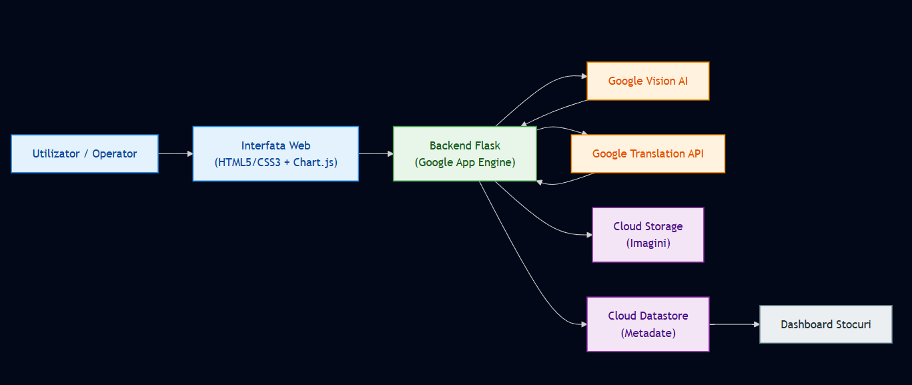

## 1. Introducere
Proiectul nostru, intitulat „Smart Inventory Management”, s-a nascut din dorinta de a simplifica procesul obositor de gestionare a stocurilor in depozite. In loc sa introducem manual fiecare produs intr-o baza de date, am creat o aplicatie web care „vede” si „intelege” obiectele prin intermediul inteligentei artificiale. Utilizatorul trebuie doar sa incarce o poza, iar restul muncii - identificarea tipului de produs, a brandului si a culorii - este preluat de ecosistemul Google Cloud.

## 2. Scopul Aplicatiei (Application Goal)
Obiectivul principal a fost dezvoltarea unei platforme centralizate unde produsele pot fi inregistrate rapid in mai multe puncte de lucru (Depozite Zona Nord, Sud, Vest). Aplicatia automatizeaza clasificarea produselor, eliminand erorile umane si oferind administratorilor o privire de ansamblu, in timp real, asupra stocurilor prin grafice de tip dashboard.

## 3. Scenarii de utilizare in lumea reala (Real-World Scenarios)
Cel mai bun exemplu este un magazin de tip e-commerce de haine second-hand sau outlet, unde fiecare piesa este unica. Intr-un astfel de depozit, volumul de munca pentru a scrie manual „Tricou negru Adidas marimea L” pentru mii de produse este imens. Cu aplicatia noastra, un operator face o poza, AI-ul completeaza automat 80% din detalii, iar stocul este actualizat instantaneu, fiind gata de vanzare.

## 4. Scenarii de esec si gestionarea lor (Failure Scenarios)
Pe parcursul dezvoltarii, am identificat doua puncte critice unde aplicatia poate intampina dificultati:

- **Probleme de analiza AI:** Daca imaginea este neclara sau prea intunecata, Google Vision poate returna etichete generice (ex: „Textil” in loc de „Hanorac”). Am gestionat acest lucru in cod prin implementarea unor valori de tip „fallback” (Necunoscut/Articol) si permitand utilizatorului sa editeze manual datele gresite.
- **Erori de Deployment (IAM):** In faza de urcare pe App Engine, ne-am lovit de o eroare de permisiuni (Error 13), unde contul de serviciu nu avea acces la bucket-ul de staging. Aceasta este o problema comuna in Cloud, pe care am documentat-o ca fiind o bariera de securitate ce necesita configurari specifice de roluri (Storage Admin) in consola Google Cloud.

## 5. Scenarii de succes (Success Scenarios)
Intr-o functionare normala, fluxul este fluid: utilizatorul urca poza unui tricou Nike, sistemul detecteaza logo-ul, traduce „T-shirt” in „Tricou”, identifica culoarea dominanta si salveaza totul in Datastore in mai putin de 3 secunde. Rezultatul este vizibil imediat in dashboard-ul depozitului respectiv.

## 6. Structura Aplicatiei (Application Structure)
Arhitectura noastra este de tip Serverless, bazata pe microservicii Google Cloud interconectate prin Flask (Python):

- **Interfata:** HTML5/CSS3 si Chart.js pentru dashboard.
- **Stocare:** Google Cloud Storage (pentru imagini) si Google Cloud Datastore (baza de date NoSQL pentru metadate).
- **Inteligenta:** Vision AI pentru scanare si Translation API pentru localizarea datelor in romana.
- **Hosting:** Google App Engine (configurat prin `app.yaml`).

Aplicatia urmeaza un flux clar, orientat pe procesare automata in cloud. Utilizatorul incarca o imagine din interfata web, cererea ajunge in backend-ul Flask ruland pe App Engine, iar apoi imaginea este salvata in Cloud Storage. Dupa stocare, backend-ul trimite continutul catre Vision AI pentru detectie (tip produs, brand, culoare), apoi textul relevant este localizat in romana cu Translation API. Metadatele finale sunt persistate in Datastore, iar dashboard-ul construit cu Chart.js citeste aceste date pentru afisare in timp real pe zone de depozit.

### 6.2 Diagrama arhitecturii

## 7. Puncte tari si Puncte slabe (Strengths and Weaknesses)
- **Puncte tari:** Automatizarea procesarii datelor, scalabilitatea (baza de date NoSQL suporta volume imense) si utilizarea resurselor „pay-as-you-go” care reduc costurile.
- **Puncte slabe:** Dependenta critica de conexiunea la internet si de calitatea API-urilor externe. De asemenea, analiza culorilor poate fi indusa in eroare de fundalul pozei.

## 8. Directii viitoare si Imbunatatiri (Future Directions)
Pe viitor, ne-am dori sa implementam un modul de detectare automata a pretului prin compararea produsului cu baze de date online. O alta imbunatatire ar fi adaugarea suportului pentru scanarea codurilor de bare si integrarea unui sistem de notificari automate cand stocul unui anumit tip de produs scade sub o limita setata.

## 9. Concluzii
Aceasta tema ne-a oferit o perspectiva practica asupra a ceea ce inseamna „Cloud Native”. Am invatat ca dezvoltarea unei aplicatii nu se rezuma doar la scris cod, ci si la configurarea permisiunilor, gestionarea serviciilor si intelegerea modului in care diferite API-uri pot colabora pentru a crea valoare. Desi deployment-ul final ne-a dat batai de cap cu permisiunile IAM, am reusit sa livram o solutie functionala care demonstreaza puterea ecosistemului Google Cloud.

## 10. Bibliografie
- Google Cloud Documentation (Vision AI, Datastore, App Engine).
- Flask Framework Documentation.
- Python Client for Google Cloud APIs.
- Tutoriale oficiale Google Cloud Skills Boost.
